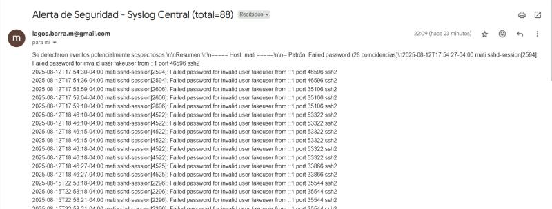

# 🪶 Syslog Central with Automatic Alerts  
### (Servidor Central de Logs con Alertas Automáticas)

---

## 🧩 Overview / Descripción  

**EN:**  
This project implements a centralized syslog server (rsyslog) on Linux to collect logs from multiple clients, analyze them for suspicious activity, and send automatic email alerts via Gmail.  
It’s ideal for learning centralized monitoring, Linux log analysis, and automation with Bash.  

**ES:**  
Este proyecto implementa un servidor syslog centralizado (rsyslog) en Linux para recopilar logs de múltiples clientes, analizarlos en busca de actividad sospechosa y enviar alertas automáticas por correo electrónico mediante Gmail.  
Ideal para aprender monitoreo centralizado, análisis de logs y automatización con Bash.  

---

## 🧱 Architecture / Arquitectura  

**EN:**  
- **Clients (Debian):** forward logs to the central server.  
- **Central Server:** receives and stores logs by host using rsyslog.  
- **Scripts:** analyze logs and send alerts automatically via Gmail.  

**ES:**  
- **Clientes (Debian):** envían los logs al servidor central.  
- **Servidor Central:** recibe y guarda los logs por host usando rsyslog.  
- **Scripts:** analizan los logs y envían alertas automáticas por Gmail.

[ Client (Debian) ] ---> [ Central Syslog Server ] ---> [ Gmail (alerts) ]
rsyslog rsyslog (receiver) msmtp + Bash scripts

## ⚙️ Setup / Configuración  

### 🖥️ Central Server  

**EN:** Edit `/etc/rsyslog.conf` to enable UDP and TCP reception:

**ES:** Edita `/etc/rsyslog.conf` para habilitar recepción UDP y TCP:  

UDP
module(load="imudp")
input(type="imudp" port="514")

TCP
module(load="imtcp")
input(type="imtcp" port="514")

Save logs by host
$template RemoteLogs,"/var/log/remote/%HOSTNAME%/syslog"
*.* ?RemoteLogs

sudo systemctl restart rsyslog

💻 Clients

**EN:** Create /etc/rsyslog.d/01-remote.conf:

**ES:** Crea /etc/rsyslog.d/01-remote.conf:

*.* @SERVER_IP:514    # UDP
*.* @@SERVER_IP:514   # TCP

sudo systemctl restart rsyslog

📜 Scripts / Scripts

🔹 log-analyzer.sh

**EN:**
Analyzes received logs, searches for suspicious patterns (failed logins, invalid users, etc.), and sends alerts when thresholds are exceeded.
Uses hashing to prevent duplicate alerts.

**ES:**
Analiza los logs recibidos, busca patrones sospechosos (intentos fallidos de inicio de sesión, usuarios inválidos, etc.) y envía alertas cuando se superan los umbrales.
Utiliza hash para evitar alertas duplicadas.

🔹 alerts-gmail.sh

**EN:**
Helper script for sending alerts via Gmail using msmtp.

**ES:**
Script auxiliar para enviar alertas mediante Gmail usando msmtp.

📧 Gmail Configuration / Configuración de msmtp

File / Archivo: ~/.msmtprc

defaults
auth           on
tls            on
tls_trust_file /etc/ssl/certs/ca-certificates.crt
logfile        ~/.msmtp.log

account gmail
host smtp.gmail.com
port 587
from your_email@gmail.com
user your_email@gmail.com
password YOUR_APP_PASSWORD

account default : gmail

**EN:** You must use a Gmail App Password, not your regular password.

**ES:** Debes usar una App Password de Gmail, no tu contraseña normal.

🚀 Usage / Ejecución

| Action (EN)        | Acción (ES)           | Command                                    |
| ------------------ | --------------------- | ------------------------------------------ |
| Run analyzer       | Ejecutar analizador   | `./log-analyzer.sh`                        |
| Generate test log  | Generar log de prueba | `logger "Final test from Debian client"`   |
| View received logs | Ver logs recibidos    | `tail -n 10 /var/log/remote/CLIENT/syslog` |

Example alert subject / Ejemplo de asunto del correo:
Security Alert - Syslog Central (total=88)

🔄 Automation / Automatización

**EN:** Add to cron to run every 5 minutes.

**ES:** Agrega al cron para ejecutarse cada 5 minutos.

( crontab -l 2>/dev/null; echo "*/5 * * * * /home/$USER/linux-projects/08-syslog-central/log-analyzer.sh" ) | crontab -
crontab -l

🛠️ Troubleshooting / Solución de Problemas

| Issue (EN)                              | Solución (ES)                                              |
| --------------------------------------- | ---------------------------------------------------------- |
| Error 454-4.7.0 Too many login attempts | Espera 1 hora antes de reintentar. Verifica App Password.  |
| No email received                       | Revisa `~/.msmtp.log` y permisos (`chmod 600 ~/.msmtprc`). |

## 🖼️ Screenshot / Captura de Ejecución  

**EN:** Below are real examples of Syslog Central detecting suspicious activity and sending automatic alerts via Gmail. 

**ES:** A continuación se muestran ejemplos reales de Syslog Central detectando actividad sospechosa y enviando alertas automáticas a través de Gmail.  

  
   
  <em>📧 Email alert received from Syslog Central showing 88 suspicious login attempts.</em>

---

  
   
  <em>🖥️ Execution of log-analyzer.sh detecting suspicious patterns and triggering email alert.</em>

🧠 Notes / Notas

**EN:**
This project is part of my Linux Automation & Security Toolkit series, focused on practical scripting for log management, security monitoring, and automation.

**ES:**
Este proyecto forma parte de mi serie Linux Automation & Security Toolkit, enfocada en scripting práctico para gestión de logs, monitoreo de seguridad y automatización.

👨‍💻 Developed by Matías Lagos Barra — Cloud & DevSecOps Engineer
